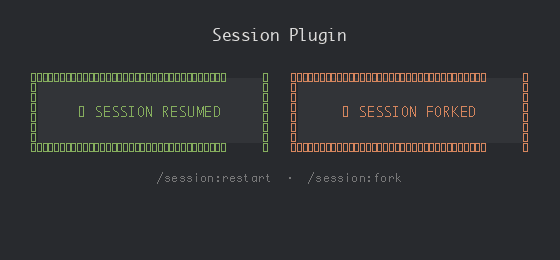

# NQH Claude Plugins

A catalog of Claude Code plugins for workflow automation.

## Add Marketplace

```
/plugin marketplace add nqh-packages/nqh-claude-plugins
```

---

## Plugins

<!-- AUTO-GENERATED: run `bun run build:readme` to update -->

### [session](./plugins/session/)

Commands to restart or fork your Claude Code session automatically with beautiful UI feedback.

```
/plugin install session@nqh-plugins
```



<!-- END AUTO-GENERATED -->

---

See [CLAUDE.md](./CLAUDE.md) for plugin development.
