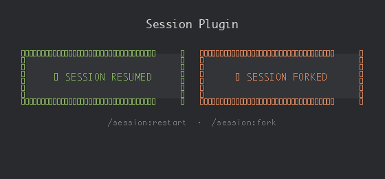

# NQH Claude Plugins

A catalog of Claude Code plugins for workflow automation.

## Add Marketplace

```
/plugin marketplace add nqh-packages/nqh-claude-plugins
```

---

## Plugins

<!-- AUTO-GENERATED: run `bun run build:readme` to update -->

### [dev-fundamentals](./plugins/dev-fundamentals/)

Core development methodologies: systematic debugging, testing, TDD, and research skills.

```
/plugin install dev-fundamentals@nqh-plugins
```

```
dev-fundamentals (core)
├── skills/
│   ├── debugging-systematically    # 4-phase scientific debugging
│   ├── testing-systematically      # ZOMBIES test case analysis
│   ├── tdd-methodology             # RED-GREEN-REFACTOR
│   ├── researching                 # Research orchestration
│   ├── waiting-for-conditions      # Async/polling patterns
│   ├── determining-test-truth      # Test result verification
│   ├── capturing-screenshots       # Visual debugging
│   ├── writing-markdown            # Documentation output
│   └── writing-typescript-logs     # Structured logging
└── agents/
    ├── debugger                    # Autonomous debugging specialist
    └── research-agent              # Web research with credibility scoring
```

### [dev-fundamentals-react](./plugins/dev-fundamentals-react/)

TanStack Start, shadcn/ui, implementation standards, and testing.

```
/plugin install dev-fundamentals-react@nqh-plugins
```

```
skills: building-tanstack-apps, writing-shadcn-components, writing-react-components
agents: react-pro, react-test-pro
```

### [dev-fundamentals-react-native](./plugins/dev-fundamentals-react-native/)

Testing, SDK migration, NativeWind, and Expo configuration.

```
/plugin install dev-fundamentals-react-native@nqh-plugins
```

```
skills: migrating-expo-sdk, configuring-expo-apps, building-expo-dev-clients, migrating-nativewind-v5
agents: react-native-pro, react-native-test-pro
```

### [dev-fundamentals-typescript](./plugins/dev-fundamentals-typescript/)

TypeScript/Node.js testing specialist with Vitest and MSW.

```
/plugin install dev-fundamentals-typescript@nqh-plugins
```

```
dev-fundamentals-typescript (addon)
└── agents/
    └── typescript-test-pro    # Expert TypeScript test writer
```

### [framer-mcp](./plugins/framer-mcp/)

MCP server for Framer design tool integration.

```
/plugin install framer-mcp@nqh-plugins
```

```
framer-mcp
└── (in development)
```

### [git-backup](./plugins/git-backup/)

Automatic daily backup of any folder to a private GitHub repo using macOS launchd.

```
/plugin install git-backup@nqh-plugins
```

```
┌─────────────────────────────────────────┐
│  Your Folder    ──────►  Private Repo   │
│  ~/.claude             github.com/...   │
│                                         │
│  ⏰ Daily @ 9 AM (via launchd)          │
│  📦 Auto-commit if changes exist        │
│  🔄 Skip if no changes                  │
│  ⚠️  Warns about large files/git repos  │
└─────────────────────────────────────────┘
```

### [session](./plugins/session/)

Intelligently restart, fork, or delegate your Claude Code sessions with beautiful UI feedback.

```
/plugin install session@nqh-plugins
```



### [swd](./plugins/swd/)

Swift/iOS development toolkit with MCP servers, debugging, testing, and modern patterns.

```
/plugin install swd@nqh-plugins
```

```
swd (addon)
├── .mcp.json                    # 4 MCP servers
├── skills/
│   ├── testing-swift-apps       # Swift Testing patterns
│   ├── logging-swift-apps       # Structured Swift logging
│   ├── swift-concurrency        # Swift 6 strict concurrency
│   ├── swiftui-patterns         # iOS 26+ SwiftUI patterns
│   └── xcode-cloud              # CI/CD workflows
└── agents/
    ├── swift-pro                # Expert Swift developer
    ├── swift-test-pro           # Expert Swift test writer
    └── swift-debugger           # Crash/memory/logging debugger
```

<!-- END AUTO-GENERATED -->

---

See [CLAUDE.md](./CLAUDE.md) for plugin development.
